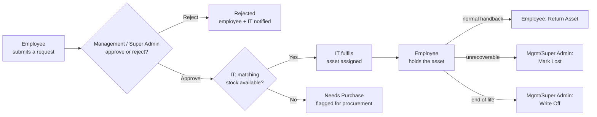
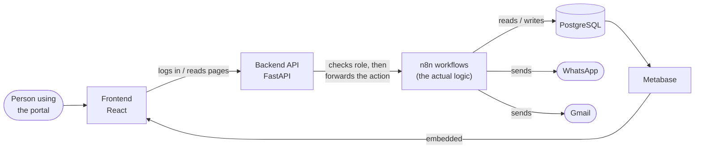
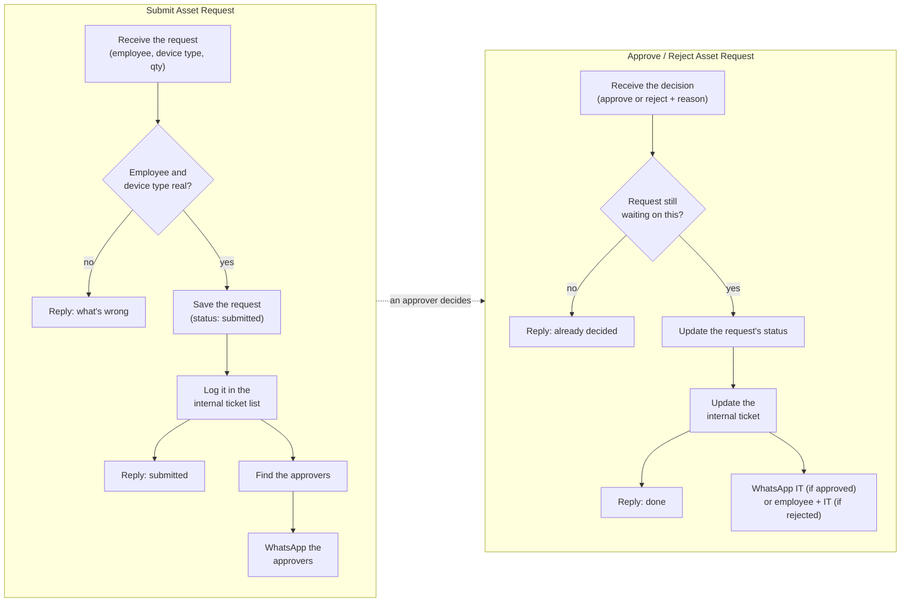
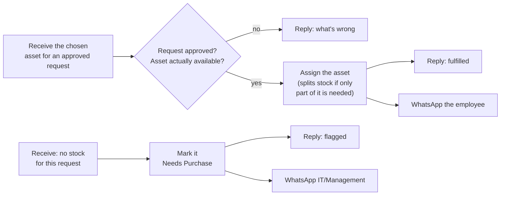
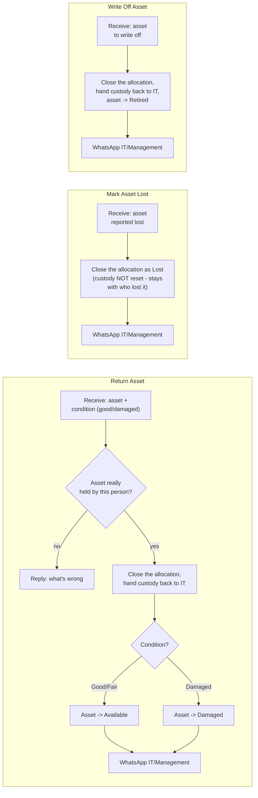
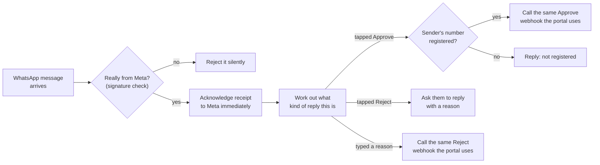
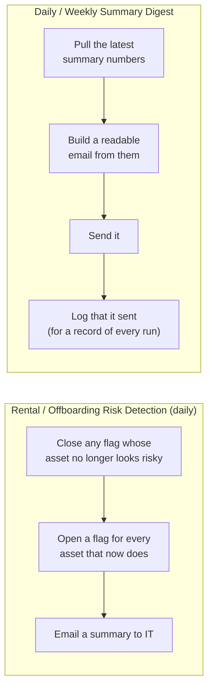

# IT Asset Management Portal
### User Guide

This guide explains how to use the IT Operations Asset Platform — the internal web
portal for requesting, approving, issuing, and returning IT assets (laptops, desktops, monitors,
phones, and other office IT hardware).

- Covers **how to use what is live today** — not a technical/architecture deep-dive (see §12 for
  a short technical overview, and `docs/N8N_WORKFLOWS.md` for the full engineering reference).

## Contents

1. [What the portal does](#1-what-the-portal-does)
2. [Roles & permissions](#2-roles--permissions)
3. [Logging in](#3-logging-in)
4. [Everyday actions (all employees)](#4-everyday-actions-all-employees)
5. [Fulfillment (IT)](#5-fulfillment-it)
6. [Approvals (Management / Super Admin)](#6-approvals-management--super-admin)
7. [Add Employee](#7-add-employee)
8. [Roles page](#8-roles-page)
9. [Status glossary](#9-status-glossary)
10. [Notifications](#10-notifications)
11. [Reporting dashboard](#11-reporting-dashboard)
12. [How it's built (technical overview)](#12-how-its-built-technical-overview)

---

## 1. What the portal does

IT Asset Platform replaces ad-hoc, off-system asset requests with a single tracked workflow:

- **Every step is recorded** — a current, queryable record of who has what, what's pending, and
  what's been approved/rejected/fulfilled, replacing manual tracking in spreadsheets or chat
  threads.
- **A live reporting dashboard** (built on Metabase) is embedded directly in the portal — a
  always-current view of asset counts, custody, and status, for anyone who wants a summary
  without digging through individual requests (§11).

---

## 2. Roles & permissions

Every login has exactly one role. The portal's left-hand menu automatically shows only the pages
a role is allowed to use.

| Can do this... | Employee | IT | Management | Super Admin |
|---|:---:|:---:|:---:|:---:|
| Submit a request | ✓ | ✓ | ✓ | ✓ |
| View own requests & assets, return own asset | ✓ | ✓ | ✓ | ✓ |
| View all assets | — | ✓ | ✓ | ✓ |
| Fulfil an approved request / mark Needs Purchase | — | ✓ | ✓ | ✓ |
| Flag/unflag an asset as high-value | — | ✓ | ✓ | ✓ |
| Add a new employee login (employee-role only) | — | ✓ | ✓ | ✓ |
| Approve / reject a request | — | View only | ✓ | ✓ |
| Mark an asset Lost or Write it off | — | — | ✓ | ✓ |
| Create an IT / Management / Super Admin login | — | — | ✓ | ✓ |
| Change anyone's assigned role | — | View only | ✓ | ✓ |

- **Management and Super Admin have the same access today** — Super Admin is the top-level
  administrative role, not one with extra permissions of its own beyond that.
- An **Employee** never sees the admin pages (Approvals, Fulfillment, Assets, Add Employee,
  Roles) — they're simply not in their menu.

---

## 3. Logging in

- Sign in at the portal's login page with your **Employee ID** and password.
- A brand-new employee doesn't have a login until one is created for them (§7) — logins are
  created when someone first needs the system, not seeded in bulk ahead of time.
- Forgot your password? Use **Forgot password** on the login page — a reset link is emailed to
  the address on file and expires after a short window for security.

---

## 4. Everyday actions (all employees)

- **Dashboard** — the landing page after login.
  - Summary tiles: total asset units, assets in use, available stock, open risk flags, and more.
  - The embedded reporting dashboard, for a deeper breakdown by office/device type/status (§11).
- **New Request** — ask for a device.
  - Pick a **device type** (e.g. "Laptop", "Monitor") and the **quantity** you need.
  - You don't pick a specific asset — IT assigns the actual unit at fulfilment time.
  - Submit → shows as **Submitted**, awaiting approval.
- **My Requests** — every request you've submitted and its current status (§9): approved,
  rejected (with the reason given), fulfilled, or flagged as needing a purchase.
- **My Assets** — every asset currently or previously assigned to you.
- **Return Asset** — hand a device back.
  - Pick the asset (the dropdown defaults to your own active assets).
  - Choose its condition: **Good/Fair** (goes back into available stock) or **Damaged/Not
    Working** (marked damaged, pulled from the available pool).
  - Applies immediately — no separate approval step for returns.
  - **Management and Super Admin** additionally see two more options here, for assets that won't
    come back through a normal return:
    - **Mark Lost** — recorded as lost; stays attributed to the employee who last held it.
    - **Write Off** — retired from service entirely; custody returns to the IT team like a
      normal return.

---

## 5. Fulfillment (IT)

Once a request is **Approved**, it appears in **Fulfillment** for IT to action:

- **Fulfil** — assign an actual asset from available stock to the requester.
  - Request moves to **Fulfilled**; the asset now shows against that employee in My Assets.
  - If the stock item is a multi-unit line (e.g. a box of 10 identical cables) and the request
    needs fewer units than the line holds, the system automatically splits off just the quantity
    needed — the rest stays in stock.
- **Needs Purchase** — if no matching stock exists, flag the request instead of fulfilling it.
  Sends it to procurement rather than leaving it stuck.

---

## 6. Approvals (Management / Super Admin)

Requests land here as soon as they're submitted:

- **Approve** — the request becomes eligible for IT to fulfil.
- **Reject** — provide a reason. The request is closed; both the requesting employee and the IT
  team are notified. No further action happens automatically.
- **Tabs** filter by status: Submitted, Approved, Rejected, Needs Purchase, Returned, Lost,
  Written Off, All — plus a "Fulfilled (legacy)" tab held over from an earlier version of the
  workflow.

---

## 7. Add Employee

*(IT / Management / Super Admin)*

Creates a login for someone who doesn't have one yet:

- Enter their employee ID and details.
- The system generates a temporary password, shown **once** on screen — pass it to the employee
  securely, since it can't be viewed again afterward.
- The role you can assign depends on your own role — IT can only create employee-role logins;
  Management/Super Admin can create any role.

---

## 8. Roles page

- Shows every employee's current portal role.
- **Management and Super Admin** can change a role from here (e.g. promoting someone to IT or
  Management).
- **IT** can open the page to view it, but the option to actually change a role isn't available.

---

## 9. Status glossary

**Request status** (New Request / My Requests / Approvals):

| Status | Meaning |
|---|---|
| Submitted | Waiting for a Management/Super Admin decision |
| Approved | Approved, waiting for IT to fulfil |
| Rejected | Declined, with a reason recorded |
| Needs Purchase | Approved, but no matching stock — flagged for procurement |
| Fulfilled | An actual asset has been assigned to the requester |

**Asset status** (Assets / My Assets):

| Status | Meaning |
|---|---|
| Available | In stock, not currently assigned to anyone |
| In Use | Currently assigned — to an employee, or to a team/department for shared equipment |
| Pending Return | A holdover status from asset history predating the current Return workflow — no current action in the portal sets or clears it |
| Lost | Reported lost |
| Damaged / Not Working | Returned in unusable condition |
| Retired | Written off — no longer in service |

---

## 10. Notifications

- The platform is built to automatically notify people at each step of a request — new request
  awaiting approval, approved, rejected, fulfilled, returned, and so on — via WhatsApp, sent to
  the relevant approver, IT contact, or requesting employee.
- **Currently in this development environment, outbound message sending is switched off** — these
  steps still complete normally in the portal itself, a message just isn't actually delivered.

---

## 11. Reporting dashboard

The Dashboard page embeds a live reporting view (built on Metabase) showing:

- Asset counts by office and device type
- Custody/status breakdowns (who holds what, and in what condition)
- Open risk flags that IT should follow up on

Read-only, available to any logged-in role — a quick health-check of the asset estate without
navigating individual request records.

---

## 12. How it's built (technical overview)

For anyone taking over or extending the system, a map of the moving parts — what each layer is
for, exactly how a click in the portal turns into a database change, and what each workflow's
nodes actually do. This section stays at "what it does and why," in plain language; the exact
SQL/conditions behind every node are in [`docs/N8N_WORKFLOWS.md`](docs/N8N_WORKFLOWS.md).

### The stack

- **Frontend** — a React web app (the portal you log into).
- **Backend API** — a thin FastAPI service. Handles login/authentication and reads data for the
  portal's pages; does **not** contain the business logic for requests, approvals, or
  notifications — it just forwards the action to n8n and relays the response back.
- **Workflow engine (n8n)** — owns the actual process logic (see below). This is where the rules
  of "what happens next" live.
- **Database (PostgreSQL)** — the single source of truth for every asset, employee, request, and
  decision. Nothing outside this database feeds the system — no external spreadsheet or sync job.
- **Reporting (Metabase)** — a self-hosted dashboarding tool reading the same database, powering
  the embedded reporting dashboard.
- **Deployment** — the whole stack (frontend, backend, n8n, database, Metabase) runs as Docker
  containers, so it can be stood up consistently in any environment.

**The intentional split**: the backend stays thin (authentication + reading data), n8n owns
workflow/process logic, and Metabase owns reporting — each layer focused on one job rather than
duplicating logic across them.

### From a portal click to a workflow

Every write action in the portal follows the same pattern: the frontend calls the backend, the
backend checks the caller's role, then forwards the action as-is to an n8n webhook, which does
all the actual work (validation, database writes, notifications) and hands its response straight
back. This table is the map between "what you clicked" and "which workflow ran":

| Portal action | Backend endpoint | n8n webhook it calls |
|---|---|---|
| Submit a request | `POST /api/v1/asset-requests` | `portal-asset-request` |
| Approve a request | `POST /api/v1/asset-requests/{id}/approve` | `portal-approve-asset-request` |
| Reject a request | `POST /api/v1/asset-requests/{id}/reject` | `portal-reject-asset-request` |
| Fulfil a request | `POST /api/v1/asset-requests/{id}/fulfill` | `portal-fulfill-request` |
| Mark Needs Purchase | `POST /api/v1/asset-requests/{id}/needs-purchase` | `portal-request-needs-purchase` |
| Return an asset | `POST /api/v1/returns` | `portal-return` |
| Mark an asset Lost | `POST /api/v1/returns/lost` | `portal-mark-lost` |
| Write off an asset | `POST /api/v1/returns/write-off` | `portal-write-off` |
| Toggle high-value flag | `POST /api/v1/assets/{asset_id}/high-value` | `portal-toggle-high-value` |
| Forgot password | `POST /api/v1/auth/password-reset/request` | `portal-password-reset-email` |

Everything else the portal shows (Dashboard, Assets, My Assets, My Requests, Approvals list,
Roles) is a plain read from the database through the backend — no workflow runs for those, they
just display what's already there.

### Workflow walkthroughs — what each one does, node by node

#### Submit → Approve/Reject (the decision gate)

- **Submit Asset Request** — checks the request makes sense, saves it, and pings every registered
  approver on WhatsApp so nothing sits unnoticed.
- **Approve / Reject Asset Request** — two near-identical workflows. Each only acts on a request
  that's still `submitted` (so the same request can't be approved twice), records the decision,
  and notifies whoever needs to know next — IT on an approval, both the employee and IT on a
  rejection (with the reason attached).

#### Fulfil / Needs Purchase (IT turns an approval into a real asset)

- **Fulfil Asset Request** — the one query that does everything: checks the request was actually
  approved and the chosen asset is really free, hands the asset to the employee, and — if the
  stock line holds more units than this request needs — automatically splits off just the right
  quantity so the rest stays available for the next request.
- **Mark Request Needs Purchase** — IT's way of saying "approved, but nothing to give out yet."
  Flags the request for procurement instead of leaving it stuck in the fulfilment queue.

#### Return / Lost / Write Off (closing out an allocation)

- **Return Asset** — the everyday path: closes the employee's active allocation, and the asset's
  next state depends on the condition reported — back to Available, or Damaged if it came back
  broken.
- **Mark Asset Lost** — deliberately does **not** hand custody back to IT; the asset stays
  attributed to whoever lost it until someone resolves it manually.
- **Write Off Asset** — for something beyond repair: custody resets to IT like a normal return,
  but the asset becomes Retired instead of Available, so it can't be handed out again.

#### Inbound WhatsApp (approving or rejecting by replying to the message)

- Approving or rejecting from WhatsApp doesn't duplicate any logic — it just figures out who sent
  the message and what they meant, then calls the exact same `portal-approve-asset-request` /
  `portal-reject-asset-request` webhooks the portal itself calls (§ table above). One decision
  path, two ways to trigger it.
- Every inbound message is signature-checked first, so a request can't be forged into looking
  like it came from WhatsApp.

#### Scheduled jobs (nothing in the portal triggers these — they run on a timer)

- **Risk Detection** (rental & offboarding) — a daily reconcile: closes flags that no longer
  apply, opens new ones for assets that now match the risk criteria, emails IT a summary. It only
  *detects and reports* — nothing is reclaimed or changed automatically.
- **Daily/Weekly Digest** — a scheduled snapshot of the same numbers the Dashboard shows, emailed
  so nobody has to log in just to see whether anything needs attention.

For the exact query behind every node above — including every validation rule, every guard
against double-processing, and every notification's recipient logic — see
[`docs/N8N_WORKFLOWS.md`](docs/N8N_WORKFLOWS.md).

---

## Questions

For anything not covered here, or to request a role change, contact your IT team.
